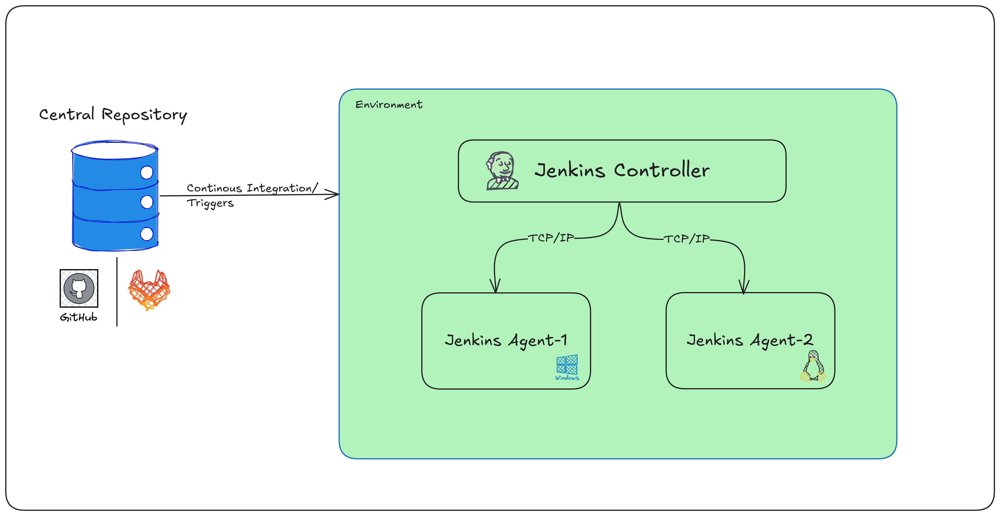

## Jenkins Architecture
---
#### Jenkins Controller/Agent:

In Jenkins, the term “master/slave” has been replaced with **controller/agent**. The **controller** schedules and orchestrates work, while **agents** execute build tasks on worker nodes. The change reflects both modern terminology and clearer separation of duties and security boundaries.

#### Architecture



Key differences and roles
- **Controller (Master):**
  - Central node that manages configuration, job scheduling, queueing, and UI/API interactions.
  - Decides which agent runs a job based on labels, availability, and constraints.
  - Monitors agents and aggregates build results and artifacts.

- **Agent (Slave):**
  - Worker node (VM, bare metal, or container) that connects to the controller and runs builds/tests as directed.
  - Can be specialized by OS or tooling (e.g., Windows, Linux, macOS) and selected via labels for targeted workloads.
  - Typically requires Java and network connectivity to the controller; can connect via SSH, JNLP/Inbound, or cloud integrations.

**Why the shift in terminology and architecture emphasis?**
- Jenkins historically allowed agents broad access on the controller, which posed security risks in multi-team or partially trusted environments.
- Jenkins introduced an **Agent → Master (Controller) Access Control** subsystem to limit what agent-sent code can do on the controller, creating a safer boundary; admins can tune or disable it if all nodes are equally trusted.
- *Modern docs and community guidance use “controller/agent,” though many articles still reference “master/slave.”*

Common usage patterns
- **Scalability and parallelism:** Distribute jobs to multiple agents to run builds/tests in parallel, improving throughput for large projects.
- **Heterogeneous environments:** Use labeled agents for OS- or tool-specific tasks (e.g., Windows UI tests, Linux backend builds, macOS UI checks).
- **Resource isolation:** Keep heavy workloads off the controller; run builds on agents with dedicated resources or ephemeral cloud nodes.

Security considerations
- Treat the controller as a high-trust node; lock down plugins and credentials there.
- Use the Agent→Master access control to restrict agent-initiated operations on the controller unless all nodes are fully trusted.
- Keep agents updated and least-privileged; prefer ephemeral agents for untrusted or variable workloads.

In pipelines
- Assign where to run using the Pipeline’s **agent** directive or stage-level agents and **labels** to target specific worker nodes.

---

## Difference Between Controller and Agents 
**=> (Static vs Dynamic Agents)**

---
#### Static vs Dynamic Agents — What’s the Real Difference?

While the **Jenkins controller** remains the fixed brain of your CI/CD system - scheduling, managing, and monitoring - **agents** come in two fundamental flavors: **static** (persistent, manually managed) and **dynamic** (ephemeral, auto-provisioned). Understanding this distinction is critical for designing scalable, secure, and cost-efficient Jenkins environments.

> *Think of static agents like full-time employees - always on, always available. Dynamic agents are like freelancers - hired on-demand, do the job, then disappear.*

---

### Static Agents: Always-On Workers

**Definition:**  
Static agents are manually configured, long-running worker nodes that stay connected to the controller until explicitly removed or taken offline.

**Common setups:**
- Physical servers or long-lived VMs
- Docker containers manually started and registered
- On-premises or cloud VMs with persistent IPs and hostnames

**Pros:**
- Immediate availability - no startup delay
- Predictable performance and environment state
- Easier to debug - logs, files, and state persist between builds

**Cons:**
- Resource waste - idle agents still consume CPU/memory/storage
- Maintenance overhead - manual patching, updates, cleanup
- Scaling challenges - adding/removing requires manual intervention
- Risk of “snowflake” environments - configuration drift over time

**Use when:**
- You have predictable, consistent workloads
- Builds require persistent state or large caches (e.g., npm, Maven, Gradle)
- You lack cloud or container orchestration infrastructure
- Security/compliance requires fixed, auditable nodes

---

### Dynamic Agents: On-Demand, Ephemeral Workers

**Definition:**  
Dynamic agents are provisioned automatically by the controller (via plugins like Kubernetes, Docker, EC2, Azure VM Agents, etc.) in response to workload demand. They connect, run one or more jobs, then terminate.

**Common setups:**
- Kubernetes pods spun up per job or stage
- Cloud VMs (AWS EC2, Azure VMs, GCP Compute) launched on-demand
- Docker containers via Docker plugin or Docker-in-Docker setups

**Pros:**
- **Cost-efficient** - pay only for resources while builds run
- **Auto-scaling** - handle spikes without manual intervention
- **Clean slate every time** - no state or pollution between builds
- **High availability** - failed agents don’t block the queue; new ones spawn

**Cons:**
- Startup latency - provisioning can add seconds or minutes to job start
- Requires infrastructure setup (K8s cluster, cloud credentials, templates)
- Debugging is harder - agents vanish after job completion
- Potential for orphaned resources if cleanup fails

**Use when:**
- Workloads are variable or bursty
- You want to enforce build reproducibility (no leftover state)
- Running in cloud or containerized environments
- Security requires isolation per job or team

---
### Key Comparison Table

| Feature                 | Static Agent                   | Dynamic Agent                           |
| ----------------------- | ------------------------------ | --------------------------------------- |
| Lifecycle               | Long-running, persistent       | Short-lived, ephemeral                  |
| Provisioning            | Manual                         | Automatic (via plugin or cloud)         |
| Scaling                 | Manual scaling                 | Auto-scaling based on queue/load        |
| Cost                    | Higher (always-on)             | Lower (pay-per-use)                     |
| Environment Consistency | Risk of drift                  | Always clean, reproducible              |
| Debugging               | Easier (persistent logs/state) | Harder (logs must be captured/exported) |
| Ideal for               | Stable, stateful workloads     | Variable, stateless, secure workloads   |

---

### How Jenkins Chooses Between Them

The controller doesn’t “prefer” one over the other - **you configure agent types via labels and cloud templates**.

- In **Freestyle jobs**: Use “Restrict where this project can be run” with agent labels.
- In **Declarative Pipelines**: Use `agent { label 'linux-dynamic' }` or `agent { kubernetes { ... } }`
- In **Scripted Pipelines**: Use `node('label')` or cloud-specific provisioning logic.

> ✅ *Tip: Use static agents for heavy caching (e.g., Maven repos) and dynamic agents for parallel test execution or PR validation.

---

### Security & Isolation Implications

- **Static agents** may accumulate secrets, logs, or artifacts - increasing attack surface over time.
- **Dynamic agents** provide natural isolation - each build runs in a fresh environment, reducing risk of cross-job contamination.
- Use **Workspace Cleanup Plugin** or container auto-removal to enforce hygiene even on static agents.

---

### Best Practices

1. **Start static, evolve dynamic** - Begin with static agents for simplicity, then introduce dynamic scaling as needs grow.
2. **Label everything** - Use descriptive labels (`os=linux`, `type=dynamic`, `pool=ephemeral`) to route jobs precisely.
3. **Monitor provisioning** - Set timeouts and alerts for failed dynamic agent launches.
4. **Capture logs/artifacts** - Since dynamic agents vanish, ensure logs and artifacts are archived or streamed to storage.
5. **Test failover** - Simulate agent failures to ensure your pipelines handle dynamic provisioning errors gracefully.

---

**Example: Pipeline with Dynamic Agent (Kubernetes)**

```groovy 
pipeline {
  agent none 
  stages {
    stage('Build') {
      agent {
        kubernetes {
          label 'dynamic-builder' 
          yaml 
          ''' apiVersion : v1 kind : Pod spec
              : containers : -name : maven image
              : maven : 3.8.6 -
                openjdk - 11 command : ['cat'] tty : true
          '''
        }
      }
      steps { sh 'mvn clean package' }
    }
  }
}
```

> This spawns a fresh Maven container per build — no leftover state, auto-scaled, and isolated.

---