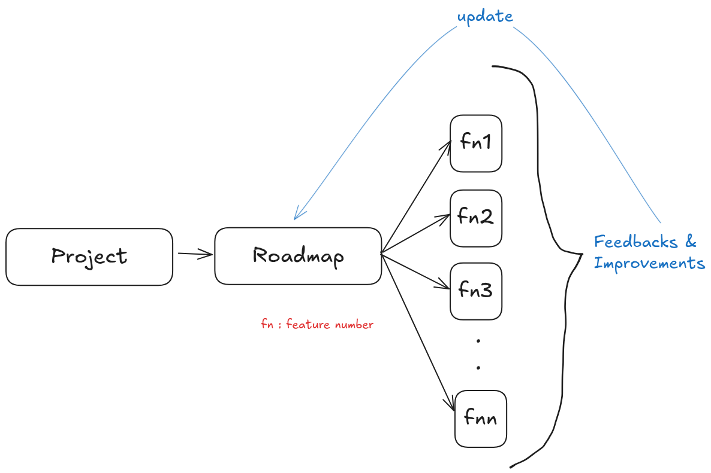

# System Design

Are you serious?: Yes
Date: August 2, 2025
Progress: Lazy Loading (Non-Thread-Safe Issue Demonstration): When multiple threads try to access getInstance() simultaneously, it can lead to multiple instances being created. (https://www.notion.so/Lazy-Loading-Non-Thread-Safe-Issue-Demonstration-When-multiple-threads-try-to-access-getInstance--2176ad1aa12a80fb9e35d4a929ecfe90?pvs=21) 
Reference 1: https://euron.one/

**Table of Contents:**

1. [**System Design - Overview**](https://www.notion.so/System-Design-Overview-2176ad1aa12a805b9962c9d6c101fe62?pvs=21) 
2. [**Low-Level Design (LLD) Fundamentals**](https://www.notion.so/Low-Level-Design-LLD-Fundamentals-2176ad1aa12a80ffb1b6fb4fad3e3265?pvs=21) 
3. [**Design Patterns I**](https://www.notion.so/Design-Patterns-I-2176ad1aa12a80e0af5cfed17cbdcb5d?pvs=21) 
4. [Design Patterns - II](https://www.notion.so/Design-Patterns-II-2466ad1aa12a80c8bda6e074027f5b77?pvs=21) 

---

# **System Design - Overview**

System design involves both High-Level Design (done by the company to address real-life problems) and Low-Level Design (done by developers).

### **Identifying Problems/Requirements**

- Real-world applications solve various problems:
    - Cab booking (Ola, Uber)
    - Grocery delivery (Blinkit, Zepto, Big Basket)
    - Food ordering (Zomato, Swiggy)
    - Medicine delivery (1mg, Practo)
- Requirements are gathered from two main sources:
    - Customers
    - Product Managers
- Self-driven ideas also contribute to problem identification (e.g., Urban Company booking).

### **Project Development Lifecycle**

- Building an application involves several stages:
    
    Design → Development → Testing → Deployment
    
- Projects often have a roadmap with features (F1, F2, F3, F4, ..., Fn) and can include improvements/enhancements.



**Example: Social Media App Features (Roadmap)**

- **Core Features (F1):**
    - Send friend requests & add friends
    - Post on wall
    - Add chat support
    - Upload image
    - Upload video
    - Like/comment on posts
- **Roadmap Example (Quarterly):**
    - Q1: F1
    - Q2: F2
    - Q3: F3
    - Q4: F4

**(Another Breakdown) Social Media App - User Stories/Features** 

- **S1:** User registration, Login, Profile creation, Adding friends
- **S2:** Post on wall, Like posts
- **S3:** Add chat support, Image/video upload
- **S4:** Add notifications, Search
- Premium features are also a consideration.

**Scoping Importance**

- Scoping is crucial for:
    - Managing complexity
    - Setting clear goals
    - Better time management
    - Ensuring steady progress

### **Key Concepts: MVP & POC**

1. **MVP (Minimal Viable Product):** The simplest version of a product that can be released to the market and provide value to customers.
    - It contains "basic features" and is "simple".
    - Often follows a prototype.
2. **POC (Proof of Concept):** A demonstration to verify that a certain concept or theory has the potential for real-world application.
    - Often precedes the MVP.
    - Can be used to attract investors.
- **Flow:** **Idea → POC → Prototype → MVP**

### **Software Development Core Components (Infrastructure)**

- An application relies on three fundamental infrastructure components:
    - **Compute:** Processing data on servers (e.g., Google Photos sync, transaction processing for a banking app).
    - **Storage:** Storing processed and raw data (e.g., Google Photos 15GB storage, user data for Uber, Netflix, YouTube).
    - **Network:** Connecting devices and servers (e.g., data Browse).
- These three components are interconnected.

**Data Examples in Applications**

- **Uber:** Map data, User data
- **Netflix/YouTube:** User data, Browse data
- **Google:** Ads data

---

# **Low-Level Design (LLD) Fundamentals**

- LLD focuses on designing an application to be "future-proof".
- It involves defining entities, their relationships, and using Object-Oriented Programming (OOP) concepts.
- **OOP Concepts:**
    - **Classes:** Blueprints for creating objects.
        - Example: `Person` class with attributes (name, age, gender) and behaviors (eat()).
        - Example: `Car` class with attributes (model number, color) and behaviors (start(), stop()).
    - **Objects:** Instances of classes.
    - **Attributes:** Properties or characteristics of an object.
    - **Behavior:** Actions an object can perform (methods/functions).
    - **Encapsulation:** Bundling data (attributes) and methods that operate on the data within a single unit (class), and restricting direct access to some of the component's parts.
    - **Abstraction:** Hiding the complex implementation details and showing only the necessary information to the user.
    - **Inheritance:** A mechanism where one class (subclass/child) inherits properties and behaviors from another class (superclass/parent).
    - **Polymorphism:** The ability of an object to take on many forms. It can be achieved through:
        - **Compile-time Polymorphism:** Method Overloading, Operator Overloading.
        - **Runtime Polymorphism:** Method Overriding.

### **Design Principles**

- Design principles are not strict rules but guidelines.
- They help address common issues in software development like:
    - Bugs appearing over time.
    - Frequent changes in requirements.
    - Increased efforts for simple tasks.

### **Key Design Principles**

- **DRY (Do Not Repeat Yourself):** Avoid duplicating code or functionality.
- **YAGNI (You Ain't Gonna Need It):** Do not add functionality until it's actually needed.
- **SOLID Principles:** A set of five design principles intended to make software designs more understandable, flexible, and maintainable.

### **S - Single Responsibility Principle (SRP):**

- **Concept:** A class should have only one reason to change. This means a class should have only one responsibility or one function.
- **Analogy:** A "Doctor" class might be too broad; it should be broken down into `General Physicians (MBBS)` and `Specialists (Masters)`.
- **Violation Example (Java Code):**
    
    ```java
    import java.util.Date;
    
    //this is a class violating SRP
    public class Employee {
        private int id;
        private String name;
        private Date doj;
    
    		//constructor
        public Employee(int id, String name, Date doj) {
            this.id = id;
            this.name = name;
            this.doj = doj;
        }
    
        //Decided by company board of directors
        public void calculateSalary() {
            System.out.println("Logic for calculating salary.");
        }
    
        //Decided by HR team
        public void hireEmployee() {
            System.out.println("Logic for hiring employee.");
        }
    
        //Decided by Managers and evaluation team
        public void evaluateEmployee() {
            System.out.println("Logic for evaluating team.");
        }
    
        public int getId() {
            return id;
        }
    
        public void setId(int id) {
            this.id = id;
        }
    
        public String getName() {
            return name;
        }
    
        public void setName(String name) {
            this.name = name;
        }
    
        public Date getDoj() {
            return doj;
        }
    
        public void setDoj(Date doj) {
            this.doj = doj;
        }
    }
    
    public class Program {
        public static void main(String[] args) {
            Employee emp = new Employee(1, "abc", new Date());
            System.out.println("Employee id : " + emp.getId());
            System.out.println("Employee name : " + emp.getName());
            System.out.println("Employee date of joining : " + emp.getDoj());
            
            // here the class hae more than one function
            emp.hireEmployee();
            emp.calculateSalary();
            emp.evaluateEmployee();
        }
    }
    ```
    
    Java*Output:*
    
    ```
    Employee id : 1
    Employee name : abc
    Employee date of joining : <current_date_and_time>
    Logic for hiring employee.
    Logic for calculating salary.
    Logic for evaluating team.
    ```
    
- **SRP Following Example (Java Code):**
    
    ```java
    import java.util.Date;
    
    //this is a class following SRP because it just contains the employee information
    public class Employee {
        private int id;
        private String name;
        private Date doj;
    
        public Employee(int id, String name, Date doj) {
            this.id = id;
            this.name = name;
            this.doj = doj;
        }
    
        public int getId() {
            return id;
        }
    
        public void setId(int id) {
            this.id = id;
        }
    
        public String getName() {
            return name;
        }
    
        public void setName(String name) {
            this.name = name;
        }
    
        public Date getDoj() {
            return doj;
        }
    
        public void setDoj(Date doj) {
            this.doj = doj;
        }
    }
    
    public class SalaryCalculator {
        //Decided by company board of directors
        public void calculateSalary(Employee emp) {
            System.out.println("Logic for calculating salary.");
        }
    }
    
    public class EmployeeEvaluator {
        //Decided by Managers and evaluation team
        public void evaluateEmployee(Employee emp) {
            System.out.println("Logic for evaluating team.");
        }
    }
    
    public class EmployeeHiring {
        //Decided by HR team
        public void hireEmployee(Employee emp) {
            System.out.println("Logic for hiring employee.");
        }
    }
    
    public class Program {
        public static void main(String[] args) {
            Employee emp = new Employee(1, "abc", new Date(122, 6, 16)); // Date(year, month, day) - year is 1900 + year
            System.out.println("Employee id : " + emp.getId());
            System.out.println("Employee name : " + emp.getName());
            System.out.println("Employee date of joining : " + emp.getDoj());
    
            SalaryCalculator salaryCalculator = new SalaryCalculator();
            salaryCalculator.calculateSalary(emp);
            EmployeeHiring employeeHiring = new EmployeeHiring();
            employeeHiring.hireEmployee(emp);
            EmployeeEvaluator employeeEvaluator = new EmployeeEvaluator();
            employeeEvaluator.evaluateEmployee(emp);
        }
    }
    ```
    
    Java*Output:*
    
    ```
    Employee id : 1
    Employee name : abc
    Employee date of joining : Sat Jul 16 00:00:00 IST 2022
    Logic for calculating salary.
    Logic for hiring employee.
    Logic for evaluating team.
    ```
    

### **O - Open/Closed Principle (OCP):**

- **Concept:** Software entities (classes, modules, functions, etc.) should be open for extension, but closed for modification.
- **Example (Java Code for OCP concept demonstration:**
    
    ```java
    public interface IAnimal {
        public void feed();
    }
    
    public class Dog implements IAnimal {
        @Override
        public void feed() {
            System.out.println("Feeding dog");
        }
    }
    
    public class Cat implements IAnimal {
        @Override
        public void feed() {
            System.out.println("Feeding cat");
        }
    }
    
    public class AnimalFeeder {
        public void feedAnimal(IAnimal animal) {
            animal.feed();
        }
    }
    
    public class Program {
        public static void main(String[] args) {
            AnimalFeeder animalFeeder = new AnimalFeeder();
            animalFeeder.feedAnimal(new Dog());
            animalFeeder.feedAnimal(new Cat());
        }
    }
    ```
    
    - Java*Output:*
    
    ```
    Feeding dog
    Feeding cat
    ```
    
- ***Explanation for OCP**:* The `AnimalFeeder` class is "closed for modification" because you don't need to change its `feedAnimal` method to add new animal types. It's "open for extension" because you can add new `IAnimal` implementations (e.g., `Lion`, `Horse`) without altering existing code in `AnimalFeeder`.

### **L - Liskov Substitution Principle (LSP):**

- **Concept:** Objects of a superclass should be replaceable with objects of its subclasses without breaking the application.

### **I - Interface Segregation Principle (ISP):**

- **Concept:** Clients should not be forced to depend on interfaces they do not use. Better to have many small, specific interfaces rather than one large, general-purpose interface.

### **D - Dependency Inversion Principle (DIP):**

- **Concept:** High-level modules should not depend on low-level modules. Both should depend on abstractions. Abstractions should not depend on details. Details should depend on abstractions.

---

# **Design Patterns I**

- Design patterns are solutions to common problems in software design.
- They are categorized into:
    - **Creational Patterns:** Deal with object creation mechanisms.
    - **Structural Patterns:** Deal with how objects and classes are composed to form larger structures.
    - **Behavioral Patterns:** Deal with how objects interact and distribute responsibility.

<aside>
❓

Three types of design patterns? ⇒ Creations patterns, Structural patterns, and Behavioural patterns.

</aside>

### **Singleton Design Pattern**

- **Purpose:** Ensures that a class has only one instance and provides a global point of access to that instance.
- **Analogy:** Imagine a single logging mechanism (`App.Log`) that all components (C1, C2, C3, etc.) within an application need to use to perform tasks like logging. Instead of each component creating its own logging object, they all access a single, shared logging object.


- **How to Create a Singleton:**
    1. **Private Constructor:** Make the constructor private to prevent direct instantiation of the class from outside.
    2. **Private Static Attribute of the Same Class:** Create a private static instance of the class itself within the class.
    3. **Public Static Method:** Provide a public static method (`getInstance()`) that returns the single instance of the class.
- **Implementation Examples:**
    - **Early Loading (Eager Initialization):** The instance is created when the class is loaded, even if it's not immediately needed.
        
        ```java
        public class SingletonExample {
            private SingletonExample() {
                System.out.println("Private Constructor");
            }
        		 // public static SingletonExample getInstance() { // return instance; // 
            private static SingletonExample instance = new SingletonExample();
        
            public void printMessage(String message) {
                System.out.println("Message: " + message);
            }
        }
        
        public class Program {
            public static void main(String[] args) {
                SingletonExample se = SingletonExample.getInstance();
                se.printMessage("Hello world");
            }
        }
        ```
        
        *Output:*
        
        ```
        Private Constructor
        Message: Hello world
        ```
        
        *Explanation:* When `SingletonExample.getInstance()` is first called, the `instance` variable is already initialized, creating the "Private Constructor" output. Subsequent calls to `getInstance()` will return the same object without calling the constructor again.
        
    - **Comparison with Non-Singleton Class (for understanding):**
        
        ```java
        public class Demo {
            public Demo() {
                System.out.println("Demo: constructor");
            }
        
            public void printDemo() {
                System.out.println("Print demo");
            }
        }
        
        // SingletonExample class (same as above - Early Loading)
        public class SingletonExample {
            private SingletonExample() {
                System.out.println("Private Constructor");
            }
        
            private static SingletonExample instance = new SingletonExample();
        
            public static SingletonExample getInstance() {
                return instance;
            }
        
            public void printMessage(String message) {
                System.out.println("Message: " + message);
            }
        
            public static void printStaticMessage(String message) { // 
                System.out.println("Static Message: " + message); // 
            }
        }
        
        public class Program {
            public static void main(String[] args) {
                // multiple instances of Demo class
                Demo obj1 = new Demo(); // 
                Demo obj2 = new Demo(); // 
                Demo obj3 = new Demo(); // 
                obj1.printDemo(); // 
                System.out.println();
        
                // single instance of SingletonExample class
                SingletonExample se1 = SingletonExample.getInstance(); // 
                SingletonExample se2 = SingletonExample.getInstance(); // 
                SingletonExample se3 = SingletonExample.getInstance(); // 
                se1.printMessage("Sample message for a non static method"); // 
                SingletonExample.printStaticMessage("Static message example"); // 
            }
        }
        ```
        
        *Output:*
        
        ```
        Demo: constructor
        Demo: constructor
        Demo: constructor
        Print demo
        
        Private Constructor
        Message: Sample message for a non static method
        Static Message: Static message example
        ```
        
        *Explanation:* Notice how "Demo: constructor" prints three times because three `Demo` objects are created. "Private Constructor" for `SingletonExample` prints only once, confirming a single instance.
        
    - **Lazy Loading (On-Demand Loading - Non-Thread Safe):** The instance is created only when it's first requested. This version is *not* thread-safe.
        
        ```java
        public class SingletonExample {
            private SingletonExample() {
                System.out.println("Private Constructor");
            }
        
            private static SingletonExample instance = null;  
            public static SingletonExample getInstance() { 
        			if (instance == null) { 
        				instance = new SingletonExample(); 
              }
              return instance;
            }
        
            public void printMessage(String message) { // 
                System.out.println("Message: " + message); // 
            }
        
            public static void printStaticMessage(String message) { // 
                System.out.println("Static Message: " + message); // 
            }
        }
        
        public class Program {
            public static void main(String[] args) {
                SingletonExample se1 = SingletonExample.getInstance(); // 
                SingletonExample se2 = SingletonExample.getInstance(); // 
                SingletonExample se3 = SingletonExample.getInstance(); // 
        
                se1.printMessage("Sample message for a non static method"); // 
                SingletonExample.printStaticMessage("Static message example"); // 
            }
        }
        ```
        
        *Output:*
        
        ```
        Private Constructor
        Message: Sample message for a non static method
        Static Message: Static message example
        ```
        
        *Explanation:* The constructor is called only when `getInstance()` is first invoked because `instance` is initially `null`. In a single-threaded environment, this works correctly.
        
    - **Lazy Loading (Non-Thread-Safe Issue Demonstration):** When multiple threads try to access `getInstance()` simultaneously, it can lead to multiple instances being created.
        
        ```java
        import java.util.concurrent.ExecutorService; // import java.util.concurrent.Executors; // public class SingletonExample {
            private SingletonExample() { // 
                System.out.println("Private constructor"); // 
            }
        
            private static SingletonExample instance = null; // public static SingletonExample getInstance() { // if (instance == null) { // 
                    instance = new SingletonExample(); // 
                }
                return instance; // 
            }
        
            public void print(String message) { // 
                System.out.println("Message: " + message); // 
            }
        }
        
        public class Program {
            private static void printFirstMessage() { // 
                SingletonExample obj1 = SingletonExample.getInstance(); // 
                obj1.print("Message from obj 1"); // 
            }
        
            private static void printSecondMessage() { // 
                SingletonExample obj3 = SingletonExample.getInstance(); // 
                obj3.print("Message from obj 2"); // 
            }
        
            private static void printThirdMessage() { // 
                SingletonExample obj1 = SingletonExample.getInstance(); // 
                obj1.print("Message from obj 3"); // 
            }
        
            public static void main(String[] args) {
                ExecutorService executorService = Executors.newCachedThreadPool(); // 
        
                Runnable createFirstObj = () -> printFirstMessage(); // 
                executorService.execute(createFirstObj); // 
        
                Runnable createSecondObj = () -> printSecondMessage(); // 
                executorService.execute(createSecondObj); // // inline
                executorService.execute(() -> printThirdMessage()); // 
        
                executorService.shutdown(); // 
            }
        }
        ```
        
        *Output (may vary due to thread scheduling, but will show multiple constructor calls):*
        
        ```
        Private constructor
        Private constructor
        Message: Message from obj 1
        Message: Message from obj 2
        Message: Message from obj 3
        ```
        
        *Explanation:* In a multi-threaded environment, if `getInstance()` is called by multiple threads when `instance` is `null`, race conditions can occur. Both threads might enter the `if (instance == null)` block and try to create a new instance, leading to multiple `Private constructor` outputs and breaking the singleton guarantee.
        
    - **Lazy Loading (Thread-Safe - Double-Checked Locking):** This approach makes the lazy initialization thread-safe by using `synchronized` blocks and `volatile` keyword.
        
        ```java
        import java.util.concurrent.ExecutorService; // import java.util.concurrent.Executors; // public class SingletonExample {
            private SingletonExample() { // 
                System.out.println("Private constructor"); // 
            }
        
            private static volatile SingletonExample instance; // `volatile` ensures visibility of writes across threads private static Object object = new Object(); // Lock object for synchronization public static SingletonExample getInstance() { // 
                SingletonExample singletonExample = instance; // First check (no lock) if (singletonExample == null) { // If instance is null, acquire lock synchronized (object) { // 
                        singletonExample = instance; // Second check (inside lock) if (singletonExample == null) { // 
                            instance = singletonExample = new SingletonExample(); // Instance created 
                        }
                    }
                }
                return singletonExample; // 
            }
        
            public void print(String message) { // 
                System.out.println("Message: " + message); // 
            }
        }
        
        public class Program {
            private static void printFirstMessage() { // 
                SingletonExample obj1 = SingletonExample.getInstance(); // 
                obj1.print("Message from obj 1"); // 
            }
        
            private static void printSecondMessage() { // 
                SingletonExample obj3 = SingletonExample.getInstance(); // 
                obj3.print("Message from obj 3"); // Note: original code prints "obj 3", but for consistency with previous print obj 2 is taken
            }
        
            private static void printThirdMessage() { // 
                SingletonExample obj1 = SingletonExample.getInstance(); // 
                obj1.print("Message from obj 1"); // 
            }
        
            public static void main(String[] args) {
                ExecutorService executorService = Executors.newCachedThreadPool(); // 
        
                Runnable createFirstObj = () -> printFirstMessage(); // 
                executorService.execute(createFirstObj); // 
        
                Runnable createSecondObj = () -> printSecondMessage(); // 
                executorService.execute(createSecondObj); // // inline
                executorService.execute(() -> printThirdMessage()); // 
        
                executorService.shutdown(); // 
            }
        }
        ```
        
        *Output (consistent, only one constructor call):*
        
        ```
        Private constructor
        Message : Message from obj 1
        Message : Message from obj 3
        Message : Message from obj 1
        ```
        
        *Explanation:* The double-checked locking ensures that the instance is created only once, even with multiple threads. The `volatile` keyword ensures that changes to `instance` are immediately visible to all threads.
        
    - **Enum Type Singleton:** This is often considered the most robust and simplest way to implement a thread-safe singleton in Java. It inherently handles serialization and reflection issues.
        
        ```java
        // SingletonEnumExample.java
        public enum SingletonEnumExample { // // the variable INSTANCE shall be compiled to a public static final field of type SingletonEnumEx
            INSTANCE; // private String message; // public void SetMessage(String message) { // this.message = message; // 
            }
        
            public void PrintDetails() { // 
                System.out.println("Message : " + message); // 
            }
        }
        
        // Demo.java (Main class to use the enum singleton)
        public class Demo {
            public static void main(String[] args) {
                // access instance of SingletonCls using getInstance() method
                SingletonEnumExample.INSTANCE.SetMessage("This message is set in main function"); // 
                SingletonEnumExample.INSTANCE.PrintDetails(); // 
            }
        }
        ```
        
        *Output:*
        
        ```
        Message : This message is set in main function
        ```
        
        *Explanation:* By declaring an enum with a single instance, `INSTANCE`, Java guarantees that only one instance of the enum type exists. This is automatically thread-safe and handles many complexities of singleton implementation.
        

---

# Design Patterns - II

### Factory Design Pattern

- 
    
    **Purpose:** The Factory design pattern is a creational pattern used for the mass production of similar kinds of products1.
    
- 
    
    **Analogy:** A car factory creates large numbers of similar cars, such as basic and sports cars2. The factory itself is responsible for creating different types of cars3.
    
- **Key Components:**
    1. 
        
        **Interface:** An interface is used to define the actual products4444. This leverages OOP principles like inheritance and polymorphism5.
        
    2. 
        
        **Child Classes:** Concrete classes are created that implement the interface6666.
        
    3. 
        
        **Factory Class:** A factory class is created which is responsible for creating the objects of the different child classes7777. The client interacts with the factory to get the desired product, abstracting away the creation logic8.
        
- **Example: Credit Card Factory**Java
    - 
        
        **`ICreditCard` Interface:** Defines methods for `GetCardType()`, `GetAnnualFee()`, and `GetCardLimit()`9.
        
    - 
        
        **`PlatinumCard` and `TitaniumCard` Classes:** Implement `ICreditCard` with specific values for each card type10101010.
        
        - 
            
            `PlatinumCard`: Annual Fee is 100, Card Limit is 1000011111111.
            
        - 
            
            `TitaniumCard`: Annual Fee is 500, Card Limit is 4000012121212.
            
    - 
        
        **`CreditCardFactory` Class:** Has a static method `GetCreditCardDetails(String cardType)` that returns the appropriate `ICreditCard` object based on the `cardType` string13131313.
        
    - 
        
        **`Demo` Class:** Shows how a client can get a credit card object by calling the factory method without knowing the specific implementation details of the `PlatinumCard` or `TitaniumCard` classes14.
        
    
    **Code Example:**
    
    # 
    
    `public interface ICreditCard {
      public String GetCardType();
      public int GetAnnualFee();
      public int GetCardLimit();
    }
    
    public class PlatinumCard implements ICreditCard {
      @Override
      public String GetCardType() {
        return "Platinum";
      }
      @Override
      public int GetAnnualFee() {
        return 100;
      }
      @Override
      public int GetCardLimit() {
        return 10000;
      }
    }
    
    public class TitaniumCard implements ICreditCard {
      @Override
      public String GetCardType() {
        return "Titanium";
      }
      @Override
      public int GetAnnualFee() {
        return 500;
      }
      @Override
      public int GetCardLimit() {
        return 40000;
      }
    }
    
    public class CreditCardFactory {
      public static ICreditCard GetCreditCardDetails(String cardType) {
        ICreditCard creditCard = null;
        if (cardType == "Platinum") {
          creditCard = new PlatinumCard();
        } else if (cardType == "Titanium") {
          creditCard = new TitaniumCard();
        } else {
          System.out.println("Invalid card");
        }
        return creditCard;
      }
    }
    
    public class Demo {
      public static void main(String[] args) {
        var creditCard = CreditCardFactory.GetCreditCardDetails("Platinum");
        if (creditCard != null) {
          System.out.println(creditCard.GetAnnualFee());
          System.out.println(creditCard.GetCardLimit());
        }
      }
    }`
    

### Abstract Factory Design Pattern

- 
    
    **Purpose:** The Abstract Factory pattern is a "super factory" or "factory of factories"15151515. It is used to create families of related or dependent objects without specifying their concrete classes16.
    
- **Advantages:**
    - 
        
        **Isolation:** It isolates the client code from the concrete implementation logic17.
        
    - 
        
        **Consistency:** It ensures consistency among different objects18.
        
- **Steps to Implement:**
    1. 
        
        **Create an Interface:** Define an interface for the products (e.g., `IAnimal` with `Speak()` and `Type()` methods)19.
        
    2. 
        
        **Create Concrete Classes:** Implement the interface with specific classes (e.g., `Cat`, `Lion`, `Shark`, `Octopus`)20.
        
    3. 
        
        **Create an Abstract Factory Class:** Define an abstract factory class (`AnimalFactory`) with an abstract method to get an animal (`GetAnimal`) and a static method to create the appropriate factory (`CreateAnimalFactory`)21212121.
        
    4. 
        
        **Create Factory Classes:** Extend the abstract factory to create concrete factories (e.g., `LandAnimalFactory`, `SeaAnimalFactory`) that are responsible for creating objects of the concrete classes222222222222222222.
        
    5. 
        
        **Factory Producer:** A class to get factories based on the type requested23.
        
- **Example: Animal Factory**Java
    - 
        
        **`IAnimal` Interface:** Defines `Speak()` and `Type()` methods24.
        
    - 
        
        **Concrete Animal Classes:** `Cat`, `Lion`, `Shark`, `Octopus` implement `IAnimal`25252525252525252525252525252525.
        
    - 
        
        **`AnimalFactory` Abstract Class:** Has `GetAnimal(String animalType)` and `CreateAnimalFactory(String factoryType)` static method that returns a `LandAnimalFactory` or `SeaAnimalFactory`26262626.
        
    - 
        
        **`LandAnimalFactory` and `SeaAnimalFactory` Classes:** Extend `AnimalFactory` and implement `GetAnimal()` to return a specific land or sea animal object27272727.
        
    - 
        
        **`Demo` Class:** Shows how a client gets an animal object by first getting the correct factory and then using that factory to create the animal28.
        
    
    **Code Example:**
    
    # 
    
    `public interface IAnimal {
        public String Speak();
        public String Type();
    }
    
    public class Cat implements IAnimal {
        @Override
        public String Speak() {
            return "Meow";
        }
        @Override
        public String Type() {
            return "Cat";
        }
    }
    
    public class Lion implements IAnimal {
        @Override
        public String Speak() {
            return "Roar";
        }
        @Override
        public String Type() {
            return "Lion";
        }
    }
    
    public class Shark implements IAnimal {
        @Override
        public String Speak() {
            return "Cannot speak";
        }
        @Override
        public String Type() {
            return "Shark";
        }
    }
    
    public class Octopus implements IAnimal {
        @Override
        public String Speak() {
            return "SQUAWCK";
        }
        @Override
        public String Type() {
            return "Octopus";
        }
    }
    
    public abstract class AnimalFactory {
        public abstract IAnimal GetAnimal(String animalType);
        public static AnimalFactory CreateAnimalFactory(String factoryType) {
            if (factoryType == "Sea") {
                return new SeaAnimalFactory();
            } else {
                return new LandAnimalFactory();
            }
        }
    }
    
    public class LandAnimalFactory extends AnimalFactory {
        @Override
        public IAnimal GetAnimal(String animalType) {
            if (animalType == "Cat") {
                return new Cat();
            } else if (animalType == "Lion") {
                return new Lion();
            }
            return null;
        }
    }
    
    public class SeaAnimalFactory extends AnimalFactory {
        @Override
        public IAnimal GetAnimal(String animalType) {
            if (animalType == "Shark") {
                return new Shark();
            } else if (animalType == "Octopus") {
                return new Octopus();
            }
            return null;
        }
    }
    
    public class Demo {
        public static void main(String[] args) {
            IAnimal animal = null;
            AnimalFactory animalFactory = AnimalFactory.CreateAnimalFactory("Sea");
            animal = animalFactory.GetAnimal("Shark");
            System.out.println("Animal factory type : " + animal.Type() + ", Speak : " + animal.Speak());
            animal = animalFactory.GetAnimal("Octopus");
            System.out.println("Animal factory type : " + animal.Type() + ", Speak : " + animal.Speak());
            animalFactory = AnimalFactory.CreateAnimalFactory("Land");
            animal = animalFactory.GetAnimal("Cat");
            System.out.println("Animal factory type : " + animal.Type() + ", Speak : " + animal.Speak());
        }
    }`
    

---

## Design Pattern - III

### Observer Design Pattern 🧐

The **Observer design pattern** is a behavioral pattern that establishes a one-to-many dependency between objects. When one object, the

**Subject**, changes its state, all of its dependents, the **Observers**, are notified and updated automatically111111111. This pattern is a form of

**asynchronous** or **non-blocking communication**222222.

- **Analogy:** The document uses two analogies to explain this concept:
    1. **Phone call vs. Sending letters**: A phone call is a synchronous (blocking) communication where both parties must be actively engaged. Sending letters is an asynchronous (non-blocking) communication where a person can send a message and continue with other tasks, with the recipient receiving the message later3333333333333333.
    2. 
        
        **Course recordings**: Instead of students repeatedly "pulling" or asking for a class update (polling), they can "subscribe" to a system design course4444. When new recordings are available, the system "pushes" or "passes" the data to all subscribed students, notifying them of the change555555555.
        
- **Real-world examples**:
    - **Amazon stock notifications**: When a product, like a phone, is out of stock, customers can register to be notified. When the product becomes available, all registered customers receive an email notification666666666.
- **Implementation Actors**: The pattern involves three main actors:
    1. 
        
        **Subject**: The object that maintains a list of observers and notifies them of state changes7777777.
        
    2. 
        
        **Observer**: The dependent object that gets notified by the subject8.
        
    3. 
        
        **Client**: The class that creates and uses the subject and observer objects9.
        

---

### Code Example: Batch & Student 🧑‍🎓

The example illustrates a system where students register for a class batch. When a new study topic is added to the batch, all registered students are notified.

**Interfaces:**

- 
    
    `ISession` (Subject): An interface that defines methods for `register()`, `unregister()`, `notifyStudents()`, and `getUpdate()`10101010101010101010101010101010101010101010101010.
    
- 
    
    `IObserverStudent` (Observer): An interface with methods `update()`, `setClass()`, and `getName()`11111111111111111111111111111111.
    

**Concrete Classes:**

- `Batch` (Concrete Subject): This class implements `ISession` and maintains a list of `IObserverStudent` objects. When a new study topic is added via the
    
    `addStudyTopic()` method, it calls `notifyStudents()`, which in turn iterates through its list of observers and calls their `update()` method121212121212121212.
    
- `BatchSubscriber` (Concrete Observer): This class implements `IObserverStudent`. Its
    
    `update()` method fetches the new session plan from the subject using the `getUpdate()` method13131313.
    

Program (Client) Class:

This class demonstrates the usage. It creates a Batch subject and several BatchSubscriber observer objects. It then registers the students with the batch and sets the class for each student. Finally, when a study topic is added to the batch, the output shows that all registered students are notified automatically.

Java

# 

`public interface ISession {
    public void register(IObserverStudent student);
    public void unregister(IObserverStudent student);
    public void notifyStudents();
    public String getUpdate(IObserverStudent student);
}

public interface IObserverStudent {
    public void update();
    public void setClass(ISession session);
    public String getName();
}

// Concrete Subject
public class Batch implements ISession {
    List<IObserverStudent> registeredStudents = new ArrayList<>();
    private String studyTopic;
    
    @Override
    public void register(IObserverStudent student) {
        System.out.println("Registering student : " + student.getName());
        this.registeredStudents.add(student);
    }
    
    // other methods like unregister, notifyStudents, getUpdate...
    
    public void addStudyTopic(String studyTopic) {
        System.out.println("Added the study topic: " + studyTopic);
        this.studyTopic = studyTopic;
        notifyStudents();
    }
}

// Concrete Observer
public class BatchSubscriber implements IObserverStudent {
    private String name;
    private ISession session;
    
    public BatchSubscriber(String name) {
        this.name = name;
    }
    
    @Override
    public void update() {
        String sessionPlan = session.getUpdate(this);
        System.out.println("Fetched the session plan of the class");
    }
    
    // other methods like setClass, getName...
}

// Client
public class Program {
    public static void main(String[] args) {
        Batch batch = new Batch();
        IObserverStudent student1 = new BatchSubscriber("StudentName1");
        IObserverStudent student2 = new BatchSubscriber("StudentName2");
        batch.register(student1);
        batch.register(student2);
        student1.setClass(batch);
        student2.setClass(batch);
        batch.addStudyTopic("Observer pattern");
    }
}`

---

### Strategy Design Pattern ♟️

The

**Strategy design pattern** allows you to define a family of algorithms, put each one into a separate class, and make their objects interchangeable15. It lets the algorithm vary independently from the clients that use it16. The document provides an example of different payment strategies for an e-commerce cart.

- **Key Components**:
    1. 
        
        **Interface**: A common interface is created for all strategies (e.g., `IWalletStrategy`)17.
        
    2. 
        
        **Concrete Classes**: Multiple classes implement the strategy interface, each representing a specific algorithm (e.g., `GooglePay`, `PhonePay`)18.
        
    3. **Context Class**: A class that uses a strategy object. It has a reference to the strategy interface and provides a method to execute the strategy (e.g.,
        
        `AmazonCart`)19. The client can pass a concrete strategy object to the context class.
        
- **Code Example: Amazon Cart Payment**
    - 
        
        **`IWalletStrategy` Interface**: Defines a `pay()` method20.
        
    - 
        
        **`GooglePay` and `PhonePay` Classes**: Implement `IWalletStrategy`, each with its own `pay()` method logic21.
        
    - 
        
        **`AmazonCart` Context Class**: Holds a `Product` and a `IWalletStrategy` object22. Its
        
        `pay()` method delegates the payment logic to the held strategy object23.
        
    - **`Program` Client Class**: Creates a `Product` and an `AmazonCart`. It provides the `GooglePay` strategy to the `AmazonCart` at the time of creation. This shows how the client can choose a payment strategy at runtime24.

Java

# 

`// Step 1: Create an interface
public interface IWalletStrategy {
    public void pay(int amount);
}

// Step 2: Create concrete classes
public class GooglePay implements IWalletStrategy {
    @Override
    public void pay(int amount) {
        System.out.println("Paying by google pay, amount : " + amount);
    }
}

public class PhonePay implements IWalletStrategy {
    @Override
    public void pay(int amount) {
        System.out.println("Paying by phone pay, amount : " + amount);
    }
}

// Step 3: Create Context Class
public class AmazonCart {
    private Product product;
    private IWalletStrategy walletStrategy;

    public AmazonCart(Product product, IWalletStrategy walletStrategy) {
        this.product = product;
        this.walletStrategy = walletStrategy;
    }

    public void pay() {
        this.walletStrategy.pay(product.getProductPrice());
    }
}

// Step 4: Use the Context with a chosen strategy
public class Program {
    public static void main(String[] args) {
        Product product = new Product("Phone", 10000);
        AmazonCart amazonCart = new AmazonCart(product, new GooglePay());
        amazonCart.pay(); // Output: "Paying by google pay, amount : 10000"
    }
}`

---

## Case Study: Web crawler & Amazon cart services

### Web Crawler System Design 🌐

A **web crawler** is a program that systematically browses the World Wide Web, typically for the purpose of web indexing. A web crawler starts with a set of URLs and then downloads the content of those web pages1. It then identifies all the hyperlinks on those pages and adds them to a queue of URLs to visit2. This process is repeated to crawl a large number of web pages.

- **Process:**
    1. 
        
        **Starts with a URL**: The crawler begins with a starting URL, such as `Microsoft.com`3.
        
    2. 
        
        **Downloads Content**: It downloads all the content from that webpage4.
        
    3. 
        
        **Extracts Links**: The crawler extracts all the links on the page, which may include links to other sites like LinkedIn, Google, or Wikipedia5.
        
    4. 
        
        **Stores and Computes**: All the downloaded data is saved to storage and can be used for various computations6.
        
- **Data Size Estimation**:
    - 
        
        **Total Websites**: There are approximately 2 billion websites7.
        
    - 
        
        **Average Pages per Website**: Assuming an average of 100 pages per website, the total number of pages would be 200 billion8888.
        
    - 
        
        **Average Page Size**: The average size of a web page is about 100 KB9999.
        
    - 
        
        **Total Content Size**: The total size of all web content is estimated by multiplying the total number of pages by the average page size10.
        
        - 
            
            200 billion pages×100 KB 11
            
        - 
            
            =200×109×100×103 Bytes 12
            
        - =2×1013 Bytes
        - 
            
            =2×1010 GB 13
            
        - 
            
            =2×107 TB 14
            
        - 
            
            =2×104 PB 15
            
        - 
            
            =20 PB 16
            
    - 
        
        **Storage and Machines**: To store 20 PB of data, if each machine has 1 TB of storage, you would need 20,000 machines171717171717171717.
        
- **System Design Process**:
    1. 
        
        **Requirement Gathering**: Understand the purpose and scale of the crawler18181818181818.
        
    2. 
        
        **Scoping**: Define the boundaries and constraints of the system19191919191919.
        
    3. 
        
        **Estimation of Data Size**: Perform calculations to estimate the required storage and compute resources20202020202020.
        
    4. 
        
        **Planning**: Create a high-level plan for the system21.
        

---

### Amazon Cart Service 🛒

Designing an Amazon Cart service involves a set of interconnected services that work together to handle the process of a user buying an item22. When a user adds an item to their cart and proceeds to checkout, a sequence of microservices is involved23232323.

- **Process Flow**:
    1. 
        
        **Adding to Cart**: A user adds an item to their cart, which is handled by the **Cart Service**24242424.
        
    2. 
        
        **Initiating Checkout**: The user initiates the checkout process25252525.
        
    3. 
        
        **Authentication**: The **Authentication Service** verifies the user's identity262626262626262626262626262626.
        
    4. 
        
        **Inventory Check**: The **Inventory Service** checks if the item is available in stock272727272727272727272727272727.
        
    5. 
        
        **Payment Processing**: The **Payment Service** handles the payment for the order282828282828282828.
        
    6. 
        
        **Shipping**: The **Shipping Service** processes the order for shipment292929292929292929.
        
- **Design Steps**:
    1. 
        
        **Requirement Gathering**: Collect all requirements for the system30303030.
        
    2. 
        
        **Scoping**: Define the system boundaries and features to be included31313131.
        
    3. 
        
        **Estimation**: Estimate the necessary resources like storage and compute power32323232.
        
    4. 
        
        **Components**: Identify all the necessary components or microservices33.
        
    5. 
        
        **Implementation**: Build the system based on the design34.
        
    6. 
        
        **Testing**: Verify that the system works as expected35.
        
    7. 
        
        **Deployment**: Launch the system for user access36.
        
- **System Design Levels**:
    - 
        
        **High-Level Design**: Focuses on the overall architecture and how different components interact37.
        
    - 
        
        **Low-Level Design**: Focuses on the detailed design of individual components and their internal workings38.
        

---

## Interview Preparedeness - LLD

### Low-Level Design (LLD) Interview Preparation 📝

Low-Level Design (LLD) is a crucial part of the software development life cycle and a common topic in technical interviews. It focuses on the detailed, component-level design of a system. A typical LLD interview round lasts between 45 and 60 minutes1111.

---

### Interview Approach & Process 🧑‍💻

The goal of an LLD interview is to design a specific system, such as a movie booking application like BookMyShow2. The process generally follows these steps:

1. 
    
    **Problem Statement**: The interviewer will provide a problem statement, which often involves designing a system for a specific company or product3.
    
2. **Scope**: Define the scope of the design. This can be broken down into different phases (e.g., Phase 1, Phase 2, etc.) to manage the complexity4.
3. **Component Identification**: Identify the key components or classes required for the system. The document provides examples of classes for a movie booking app, such as:
    - 
        
        **`Movie`**: with attributes like `id` (Long), `name` (String), `description` (String), `duration` (Double), `release date` (Date Time), `cast` (String), and `Language` (Enum)5.
        
    - 
        
        **`Customer`**: with attributes like `id`, `name`, `Address`, and `Phone Numbers`666666666.
        
    - 
        
        **`Admin`**: with attributes like `id`, `name`, `Address`, `Phone number`, and `Emp Id`7777777.
        
4. **Approaches to Class Design**: The notes suggest two approaches for designing user-related classes:
    - 
        
        **Approach 1 (Inheritance)**: Create a base `User` class and have `Customer` and `Admin` classes extend it888888888. The
        
        `Customer` class might have additional attributes like `coupons`, `Referral Id`, and `support`9999. The
        
        `Admin` class might have an `Emp Id`10.
        
    - 
        
        **Approach 2 (Enumeration)**: Create a single `User` class with a `UserType` enum (e.g., `Customer`, `Admin`) to differentiate between user types11. This is often a more flexible approach.
        
5. **Implementation**: Once the design is finalized, you may need to implement some of the key methods to demonstrate your coding skills.

---

### High-Level vs. Low-Level Design 📐

The document outlines the difference between High-Level Design (HLD) and Low-Level Design (LLD) and how the focus on each changes with experience:

- 
    
    **2-3 years of experience**: The focus is approximately 70% on coding skills (DSA) and 30% on design skills12. The LLD is a greater focus than HLD13.
    
- 
    
    **2-7 years of experience**: The skills are typically balanced at 50% coding and 50% design14.
    
- 
    
    **7+ years of experience**: The focus shifts to 70% design skills and 30% coding skills15. The emphasis is more on HLD than LLD16.
    

---

### Design Patterns for LLD 🧩

A strong LLD requires a good understanding of design patterns. The user's previous notes and documents cover several key patterns that are highly relevant to LLD.

- 
    
    **Factory & Abstract Factory Patterns**: These are creational patterns used to create objects in a flexible way17171717. The Factory pattern creates objects without exposing the creation logic, while the Abstract Factory is a "factory of factories" that creates families of related objects without specifying their concrete classes18181818. Using these patterns can help to isolate client code from implementation details and ensure consistency among objects191919191919191919.
    
- 
    
    **Observer Pattern**: This behavioral pattern is for one-to-many dependencies20. A
    
    **Subject** maintains a list of **Observers** (dependents) and notifies them automatically when its state changes21212121. This is used for systems where a change in one object should trigger a change in others without the objects being tightly coupled22.
    
- 
    
    **Strategy Pattern**: This is a behavioral pattern that allows you to define a family of algorithms, encapsulate each one, and make them interchangeable23. This lets the algorithm vary independently from the client that uses it. For example, in a payment system, you can have different payment strategies (GooglePay, PhonePay) that can be swapped out easily24242424.
    

A successful LLD interview demonstrates a solid grasp of these design principles and the ability to apply them to solve a given problem.

---

## High Level Design - Introduction

### High-Level Design (HLD) 🏢

**High-Level Design (HLD)** is an overview of a system's architecture, outlining the main components, their interactions, and the overall data flow1111. It's a foundational step in the

**Software Development Life Cycle (SDLC)**2.

### HLD vs. LLD 🔍

HLD is focused on the

**big picture**, describing what a system does and how its major parts fit together3. In contrast, Low-Level Design (LLD) focuses on the detailed implementation, such as individual classes, methods, and data structures4444.

The importance of HLD vs. LLD in a software development career typically shifts with experience:

- 
    
    **2-3 years of experience**: The focus is on coding skills (70%) with less emphasis on design skills (30%)5. The focus is more on LLD than HLD6.
    
- 
    
    **2-7 years of experience**: A balanced approach, with 50% coding and 50% design skills7.
    
- 
    
    **7+ years of experience**: The emphasis is on HLD (70%) with a smaller focus on coding (30%)8.
    

### HLD Process ⚙️

The process of creating a system design, whether HLD or LLD, follows a structured approach9999:

1. 
    
    **Requirement Gathering**: Understand the problem and what the system needs to accomplish10101010101010101010101010101010.
    
2. 
    
    **Scoping**: Define the boundaries and constraints of the system11111111111111111111111111111111.
    
3. 
    
    **Estimation**: Estimate the necessary resources, such as storage and compute power12121212121212121212121212121212.
    
4. 
    
    **Components**: Identify the major components or services that will make up the system13131313.
    
5. 
    
    **Implementation**: Build the system based on the design14141414.
    
6. 
    
    **Testing**: Verify that the system works as expected15151515.
    
7. 
    
    **Deployment**: Launch the system for user access16161616.
    

---

## Web Application

Based on the document, here are the notes on web applications and their architectures.

### Websites vs. Web Applications 💻

The main difference between websites and web applications lies in their content and functionality111.

| Feature | Websites | Web Applications |
| --- | --- | --- |
| **Content** | Static content 222 | Dynamic content 333 |
| **Functionality** | Read-only access 444 | Read and write access 555 |
| **Examples** | Newspapers, Wikipedia, and blogs 666 | Gmail, Facebook, LinkedIn, Amazon, and Uber 777777777 |

Web applications are used to solve dynamic, real-life problems and enable user interaction, such as buying something, traveling, communicating with friends, or buying medicine8888.

---

### Three Layers of a Web Application 🧱

A typical web application is composed of three main layers:

- **Front-End (FE) or Visualization Layer**: This is what the user sees and interacts with. It's built using technologies like HTML, CSS, and JavaScript frameworks like Angular or React9.
- **Back-End (BE)**: This layer contains the application logic and is where the heavy processing happens. It's built using programming languages like Java, C#, or Python10101010.
- 
    
    **Data Storage Layer**: This layer is responsible for storing and managing data, often using a **DBMS** (Database Management System), such as **RDBMS** (Relational Database Management System) or **NoSQL** databases11.
    

These layers are managed by specialized roles like Front-End Engineers, Back-End Engineers, and Database Administrators (DBAs)12. An engineer who works on all three layers is called a

**Full Stack Engineer**13.

---

### Monolithic Architecture 🏗️

The document discusses the

**monolithic architecture** as a common approach for building web applications14.

- 
    
    **Concept**: In this architecture, all three layers (Front-End, Back-End, and Database) are built as a **single, unified unit** with a single code repository15.
    
- 
    
    **Examples**: Early versions of companies like LinkedIn, PayPal, and Facebook used this architecture16.
    
- **Advantages**:
    - 
        
        **Simplicity**: It has defined boundaries and simplified resource allocation17.
        
    - 
        
        **Faster Communication**: The direct communication between components, like method-to-method calls or IPC (Inter-Process Communication), results in lower latency and faster communication181818181818181818.
        
    - 
        
        **Easier Testing**: Integration testing is easier19.
        
    - 
        
        **Less Developer Confusion**: There is less confusion for developers since the entire codebase is in one place20.
        
- **Disadvantages**:
    - 
        
        **Difficult to Maintain**: The monolithic codebase can become very large and difficult to maintain over time21.
        
    - 
        
        **Slow Deployment**: As the application grows, deployment can become slow and cumbersome22.
        

---

## Distributed System - I

### Distributed Systems Notes 🌐

A distributed system involves a

**service requester** (or data requester) and a **service provider** (or data provider)111111111. Communication between them can be either unidirectional or bidirectional2222.

- 
    
    **Unidirectional Data Transfer**: This is a one-way transfer where a notification is sent from one service to another3333.
    
- 
    
    **Bidirectional Data Transfer**: This is a two-way transfer where a request is sent, and a response is received4444. An example is checking a score, where you send a request and the service replies with the score5.
    

### RPC (Remote Procedure Call)

RPC is a protocol that allows a program to request a service from a program located on another computer on a network without the need to understand the network's details6. The notes highlight an example where both the requester (Service A) and the provider (Service B) are written in Java and can use RPC to communicate directly7777.

### SOAP (Simple Object Access Protocol)

SOAP is a protocol for exchanging structured information in the implementation of web services8. It uses an XML document to send a request, and the recipient processes the XML and sends back a response, also in XML9999999999999999.

**Key characteristics of SOAP from the notes:**

- It is considered
    
    **slow, heavy, and complex** due to the use of XML tags10101010.
    
- It is
    
    **language-neutral**, which means a Java application can communicate with a C# application using SOAP11111111.
    

---

### Code Examples for Distributed Systems

While the provided notes don't include code, here are simplified examples of how you might implement these concepts in a real-world scenario.

### RPC Example (Java)

This is a conceptual example showing how a client calls a remote method as if it were a local method.

**Server-side (Remote Interface):**

Java

# 

`// Remote interface
public interface ICalculator {
    public int add(int a, int b) throws RemoteException;
}

// Server implementation
public class CalculatorImpl extends UnicastRemoteObject implements ICalculator {
    public CalculatorImpl() throws RemoteException {
        super();
    }
    public int add(int a, int b) {
        return a + b;
    }
}`

**Client-side:**

Java

# 

`// Client code to call the remote method
public class CalculatorClient {
    public static void main(String[] args) {
        try {
            ICalculator calculator = (ICalculator) Naming.lookup("rmi://localhost/CalculatorService");
            int sum = calculator.add(10, 20);
            System.out.println("Sum is: " + sum);
        } catch (Exception e) {
            System.err.println("Client exception: " + e.toString());
            e.printStackTrace();
        }
    }
}`

### SOAP Example

This is a conceptual example of a SOAP request and response using XML.

**SOAP Request (XML):**

XML

# 

`<?xml version="1.0"?>
<soap:Envelope
xmlns:soap="http://www.w3.org/2003/05/soap-envelope/"
soap:encodingStyle="http://www.w3.org/2003/05/soap-encoding">

<soap:Body>
  <m:add xmlns:m="http://www.example.org/stock">
    <m:a>10</m:a>
    <m:b>20</m:b>
  </m:add>
</soap:Body>

</soap:Envelope>`

**SOAP Response (XML):**

XML

# 

`<?xml version="1.0"?>
<soap:Envelope
xmlns:soap="http://www.w3.org/2003/05/soap-envelope/"
soap:encodingStyle="http://www.w3.org/2003/05/soap-encoding">

<soap:Body>
  <m:addResponse xmlns:m="http://www.example.org/stock">
    <m:Result>30</m:Result>
  </m:addResponse>
</soap:Body>

</soap:Envelope>`

---

## Distributed System - II

These notes provide an overview of **REST (Representational State Transfer)**, a software architectural style for creating distributed systems.

---

### Key Concepts of REST

- 
    
    **Definition**: REST is an architectural style for distributed systems, often used for web services1. The full name is
    
    **Representational State Transfer**2222.
    
- 
    
    **Data Representation**: Data is often transferred between applications as **JSON (JavaScript Object Notation)**, which can be thought of as a Python class or object333333333. The JSON object is converted into a byte stream of 0s and 1s for transmission4.
    
- 
    
    **Statelessness**: REST services are **stateless**5. This means that the server doesn't store any information about the client's state between requests. Every request from a client to the server must contain all the information needed to understand the request6.
    
- 
    
    **Wide Adoption**: REST is widely adopted for communication between front-end and back-end systems using **HTTP** (Hypertext Transfer Protocol)7777.
    
- 
    
    **Resources**: In REST, everything is treated as a **resource**, which is identified by a **URI (Uniform Resource Identifier)**8888888888888888888888888. Resources are typically named using nouns, such as "Movie" or "Theater"9.
    

---

### Advantages of REST

- 
    
    **Lightweight**: REST is considered a lightweight protocol10.
    
- 
    
    **Faster Performance**: It offers faster performance11.
    
- 
    
    **Flexibility**: REST provides flexibility in its use12.
    
- 
    
    **Ease of Use**: It's easy to use13131313.
    
- 
    
    **Statelessness**: Its stateless nature is a key advantage14.
    
- 
    
    **Wide Adoption**: It has wide adoption across the industry15.
    

---

### HTTP Methods and CRUD Operations

REST uses standard HTTP methods to perform actions on resources. These methods map to the standard **CRUD** (Create, Read, Update, Delete) operations:

- 
    
    **Create (C)**: Uses the **`POST`** method1616. For example, a
    
    `POST` request to `/movies` creates a new movie171717171717171717.
    
- 
    
    **Read (R)**: Uses the **`GET`** method18181818. A
    
    `GET` request to `/movies/123` would retrieve the movie with ID `123`1919191919.
    
- 
    
    **Update (U)**: Uses the **`PUT`** or **`PATCH`** methods20202020.
    
- 
    
    **Delete (D)**: Uses the **`DELETE`** method21212121.
    

---

### URI Naming Standards

To create effective and predictable RESTful APIs, there are two important standards for naming URIs:

1. 
    
    **Use Nouns, Not Verbs**: The URI should describe the resource itself, not the action being performed on it22222222. For example, use
    
    `/movies` instead of `/createMovies`23. The action is specified by the HTTP method (
    
    `GET`, `POST`, `PUT`, `DELETE`), not in the URI24.
    
2. 
    
    **Use Plurals**: Always use the plural form for resource names in the URI, like `/movies` instead of `/movie`2525252525.
    

For example, a URI for a movie booking application might look like this:

`192.168.1.100:8080/mba/v1/movies/123`26262626.

- 
    
    **`192.168.1.100`**: The IP address of the server272727272727272727.
    
- 
    
    **`8080`**: The port number of the application28282828282828282828282828282828.
    
- 
    
    **`/mba/v1`**: The application identifier and version number29292929292929292929292929292929.
    
- 
    
    **`/movies`**: The collection of movie resources303030303030303030.
    
- 
    
    **`/123`**: The specific identifier for a movie resource313131313131313131.
    

---

## Time

### Notes on Distributed System Clocks

The notes you provided cover two types of clocks used in distributed systems: **physical clocks** and **logical clocks**. The primary challenge in a distributed system is that each machine has its own clock, and these clocks can drift, making it difficult to establish a global, consistent order of events. Logical clocks were developed to address this problem by focusing on the causal relationship between events rather than on physical time.

---

### Physical Clocks

- **Definition**: These are the real-time clocks found in computer systems, which track time using hardware-based mechanisms like a quartz crystal oscillator.
- **Problem**: Physical clocks in different machines can drift over time, leading to inconsistencies. Perfectly synchronizing them is very difficult.

---

### Logical Clocks

- **Definition**: Logical clocks are a software-based counter used to order events in a distributed system based on their causal relationship, or "happens before" relationship, which is denoted as A → B.
- **Key Principle**: If event A happens before event B, then the logical timestamp of A will be less than the logical timestamp of B.

---

### Lamport's Logical Clock

This is a specific type of logical clock that follows a set of rules to ensure event ordering.

### Rules:

1. **Local Events**: Each process (a separate, running program) maintains its own counter, which is the logical clock. The counter is incremented by one before any local event occurs.
2. **Sending Messages**: When a process sends a message, it includes its current logical clock value (timestamp) with the message.
3. **Receiving Messages**: When a process receives a message, it updates its own logical clock to be the maximum of its current clock value and the timestamp received in the message. It then increments its clock by one.

### Example Calculation:

Let's consider an example with three processes: P1, P2, and P3, where each has a local counter (logical clock). Initially, all clocks are at 0.

- **P1 Local Event**: P1's clock increments from 0 to **1**. P1 then sends a message (M1) to P2 with the timestamp `1`.
- **P2 Local Event**: P2's clock increments from 0 to **1**. P2 then sends a message (M2) to P3 with the timestamp `1`.
- **P3 Local Event**: P3's clock increments from 0 to **1**.
- **P2 Receives M1**: P2 receives the message from P1 with a timestamp of `1`. P2's current clock is `1`. It applies the `max(local, received_timestamp) + 1` rule: `max(1, 1) + 1 = 2`. P2's clock is now **2**.
- **P1 Receives M2**: P1 receives the message from P2 with a timestamp of `1`. P1's current clock is `1`. It applies the `max(local, received_timestamp) + 1` rule: `max(1, 1) + 1 = 2`. P1's clock is now **2**.
- **P2 Local Event**: P2's clock increments from `2` to **3**. P2 then sends a message (M3) to P3 with the timestamp `3`.
- **P3 Receives M3**: P3 receives the message from P2 with a timestamp of `3`. P3's current clock is `1`. It applies the `max(local, received_timestamp) + 1` rule: `max(1, 3) + 1 = 4`. P3's clock is now **4**.

This example shows how Lamport's algorithm provides a partial ordering of events. The logical timestamps ensure that if an event happened before another, its timestamp will be smaller, regardless of physical time. However, concurrent events (events that are not causally related) might end up with the same timestamp, as seen in the notes.

---

### Vector Clocks

- **Definition**: Vector clocks are a more advanced type of logical clock that extends Lamport's concept. Instead of a single integer, each process maintains a vector (an array) with one element for each process in the system. This allows them to not only order events but also to detect concurrent events.

---

**Note:** The notes you provided only included examples and calculations for Lamport's Logical Clock. If you need a detailed example of a vector clock, additional information would be required.

---

## Databases

### **Database Fundamentals**

- A database is a system used for storing and retrieving data1111. The diagram suggests that 90% of data is stored for the "last couple years only"2.
- The process involves capturing information and using it later3.
- A
    
    **distributed system** handles big data4444.
    

### **Historical Context: File-Based Storage Systems (FBSS)**

- The earliest form of storage mentioned is the
    
    **File-Based Storage System (FBSS)**, which existed around the 1950s5. This system stored individual documents, like .txt or .doc files, in folders6.
    

### **Limitations of FBSS:**

- It required programmers to manage the data7.
- Data could be duplicated, leading to
    
    **data redundancy**8888.
    
- Deleting data was difficult9.
- It often resulted in
    
    **inconsistent data**10.
    

### **Database Management Systems (DBMS)**

- A **Database Management System (DBMS)** is a system for managing databases. It is composed of two parts: the physical database itself and a management system, which acts as a software layer11111111.
- Examples of a DBMS include Oracle and MySQL12.
- A key feature of a DBMS is the use of
    
    **SQL (Structured Query Language)**, which allows users to interact with the database using a language similar to English13.
    

---

### **Types of Databases**

### **Relational Database Management Systems (RDBMS)**

- RDBMS is a type of DBMS where data is organized into
    
    **tables**14141414.
    
- Tables are linked together using
    
    **primary keys (Pk)** and **foreign keys (FK)**15151515.
    
- RDBMS uses a
    
    **fixed schema**, meaning the number of rows and columns is predetermined16161616. Examples include bank data and e-commerce product catalogs171717171717171717.
    
- RDBMS provides **ACID** properties, ensuring transaction integrity. This means transactions are either fully completed or not at all (
    
    **"all or nothing"**)18181818.
    

### **NoSQL Databases**

- 
    
    **NoSQL** databases, such as **MongoDB**, use a **dynamic schema**, allowing for flexible document-based data structures191919191919191919. This is different from the fixed schema of RDBMS20202020.
    

---

### **Storage and Computation**

- The document also briefly mentions the concepts of
    
    **storage** and **computation**21212121.
    
- A computational engine processes data22.

---

## Scalability

Scalability is the ability of an application to handle an increased number of users or transactions without a drop in performance1111. This is considered a good problem to have as it indicates a positive sign of growth, meaning more users are engaging with the application2222.

## Types of Scaling

There are two primary methods to achieve scalability:

**Vertical Scaling** and **Horizontal Scaling**3.

### Vertical Scaling (Scaling Up)

Vertical scaling involves increasing the resources of a single server4. This can be done by adding more storage, RAM, or CPU to the existing machine555555555. The main limitations of vertical scaling are:

- 
    
    **Hardware limitations**: There's a physical limit to how much you can upgrade a single machine (e.g., a phone might only have two memory card slots)6.
    
- 
    
    **Cost consideration**: At a certain point, the cost of increasing performance outweighs the benefits, leading to diminishing returns on investment7777777777777777777777777. Companies must find a trade-off between cost and performance to remain profitable8888888888888888.
    
- 
    
    **Single point of failure**: If the single, centralized system fails due to issues like a power outage, the entire application goes down9999999999999999999999.
    

---

### Horizontal Scaling (Scaling Out)

Horizontal scaling involves adding more machines to a system instead of increasing the resources of a single one10101010101010101010101010101010. This is also known as a

**distributed system** and involves using a cluster of multiple machines to handle the load11111111. This approach offers

**flexibility** and avoids the single point of failure inherent in vertical scaling because if one machine fails, others can continue to operate12121212.

---

## Optimisation of Databases

Optimization involves improving an application's performance, often when it becomes slow despite having sufficient resources like free storage111111111. A common cause for poor performance is improper database indexing2.

---

### Database Indexing

A database index is a data structure used to improve the speed of data retrieval operations3333. It works by creating a copy of a specific column, sorting the values in that copy, and storing it in a separate location on the hard disk4. This sorted copy allows for faster searching5555. Instead of scanning the entire table (a process with a time complexity of

O(n)) 6666, a query can use the index, which is often structured as a balanced binary search tree, to find data with a time complexity of

O(logn)7.

- 
    
    **Example**: When you search for a specific name like "abc" in a user table, a query without an index would have to check every single row8888. With an index on the "name" column, the database can quickly locate "abc" using an efficient search algorithm on the sorted index9.
    
- 
    
    **Data Structure**: Balanced Binary Search Trees (BST), like the **Red-Black Tree**, are commonly used for database indexing because they maintain a balanced structure, ensuring that search, insertion, and deletion operations all have a time complexity of O(logn)10. This is particularly useful for applications with constantly changing data, such as tracking dynamic locations in Google Maps or Uber11111111.
    
- 
    
    **Best Practices**: Indexing is most effective for applications that are **read-heavy**12. It speeds up read operations but can slow down write operations because the index also needs to be updated13. Therefore, indexes should only be applied to columns that are frequently queried14.
    
- 
    
    **Text-based Queries**: Standard indexing is not suitable for text-heavy queries (e.g., using `LIKE` with wildcards)151515151515151515. For these, specialized databases like
    
    **Elasticsearch** are optimized to handle text-based searches efficiently16.
    

---

### Horizontal Partitioning (Sharding)

Partitioning is another optimization technique that involves dividing a large database into smaller, more manageable parts17.

**Horizontal partitioning**, also known as **sharding**, divides a database table's rows into separate, smaller tables based on a defined range18.

- **Example**: A database with millions of user records and zip codes can be partitioned. Records with zip codes from 1 to 500 can be stored on one machine, those from 501 to 5000 on a second, and so on19. This distributes the data and load across multiple machines, which is a characteristic of a distributed system20.
- 
    
    **Vertical partitioning** also exists but works by dividing a table's columns into separate tables21.
    

---

## Performance Optimisation

The notes you provided cover several topics related to system optimization and performance, including horizontal scaling, load balancing, and caching.

---

### Horizontal Scaling

**Horizontal scaling** is a method of scaling an application by adding more machines to handle an increased load1. The document notes that a single machine might handle 300 queries per second, but a company may need to handle 1000 queries per second2222. Horizontal scaling addresses this by distributing the load across multiple machines, such as M1, M2, M3, and M4, to prevent performance issues and load problems3333.

---

### Load Balancing

Load balancing is a technique used to distribute incoming network traffic across a group of backend servers or instances4. A

**load balancer** acts as a single point of contact for clients, directing their requests to the appropriate available instance5555. This helps to prevent performance issues and load imbalance by ensuring that no single machine is overwhelmed with traffic6666.

The notes also discuss different types of load balancers:

- 
    
    **Replicated Load Balancer**: To avoid a single point of failure, load balancers can be replicated, with one acting as the active load balancer and others as passive ones7777.
    
- 
    
    **Hardware Load Balancer**: These are more expensive and less flexible but offer better performance8.
    
- 
    
    **Software Load Balancer**: These are cheaper and more flexible but have lower performance compared to hardware load balancers9.
    
- 
    
    **Distributed Load Balancer**: This type of load balancer is responsible for knowing the IP addresses of all machines and monitoring their health and load10101010. They also measure response time and consider geographical distance when distributing traffic11.
    

---

### Weighted Load Balancing

**Weighted load balancing** assigns a different weight to each machine based on its capabilities, such as RAM, to ensure that more powerful machines receive more traffic12121212121212. For example, a machine with 16 GB of RAM would be assigned a higher weight than one with 8 GB of RAM13. This helps to distribute the load more effectively, preventing performance issues on less powerful machines14.

---

### Caching

Caching can significantly improve application performance by storing data that doesn't change frequently15151515. This allows for faster data retrieval for repeat requests. The document mentions two types of caching:

- 
    
    **Read-through cache**: This is similar to a sweets shop that has different hours each day, with a daily or weekly cache161616161616161616. The cache is designed to be moderately used and stores data for a specific duration17171717.
    
- 
    
    **Write-through cache**: The notes refer to this in the context of an example like a movie booking application, but do not provide a detailed description18.
    

---

## NoSQL

### NoSQL Databases

**NoSQL** (short for "not only SQL") databases are non-relational databases that store data in a non-tabular format, unlike traditional relational databases (RDBMS). They use a flexible schema model that is well-suited for unstructured and semi-structured data. The notes you provided indicate that NoSQL databases complement SQL databases and address issues with the latter, such as problems with fixed schemas, transaction support, and scalability as data volume increases.

---

### Types of NoSQL Databases

Your notes identify four main types of NoSQL databases.

1. **Key-Value Based Databases**: This is the simplest type of NoSQL database, where data is stored in pairs of unique keys and values. The key is used as a unique identifier to retrieve the associated value. The notes you provided describe how data is stored in pairs, with an example of a key-value pair for "Salary," where "A" is the key and "90,000" is the value. The notes also highlight advantages like simplicity, ease of implementation, scalability, and efficiency. Examples of key-value stores include Redis, Couchbase, and Memcached. They are commonly used for use cases such as user preferences, shopping carts, and caching.
2. **Document-Based Databases**: These databases store data in a flexible, JSON-like format. The notes you provided give an example of a JSON document with fields like "id," "name," "age," and "gender". These databases are ideal for storing semi-structured data and are often used in content management systems, e-commerce applications, and for managing sensor data. They are designed for flexibility and can handle a wide variety of data types, including complex nested structures.
3. **Columnar Databases**: These databases organize and store data in columns rather than rows. This structure is optimized for analytical queries and large datasets. By storing data column by column, the database can quickly access and retrieve only the necessary data for a query, which reduces I/O operations and enhances performance. They are particularly well-suited for data warehousing, business intelligence (BI), and real-time analytics.
4. **Graph Databases**: These databases use a model based on nodes and edges to represent and store data. Nodes represent entities (like people or accounts), and edges represent the relationships between them. This model is highly effective for visualizing and querying highly interconnected data. Graph databases excel at finding relationships and patterns, making them ideal for use cases like social media analysis, recommendation engines, and fraud detection.

---

### When to Choose NoSQL Over RDBMS

Based on the provided information, NoSQL databases are a good choice when you need:

- **Flexibility and a Dynamic Schema**: If your data is semi-structured or unstructured and the schema may change frequently, NoSQL databases are ideal because they do not require a fixed, predefined schema.
- **Horizontal Scalability**: NoSQL databases are designed to handle large, complex datasets and can scale out horizontally by adding more servers. This is beneficial for applications with unpredictable and high-volume workloads, such as IoT and device sensor applications.
- **High Availability**: Many NoSQL databases are distributed by design, which means there is no single point of failure. They are well-suited for applications with geographically distributed users that require low-latency data access.
- **Performance**: They are optimized for fast querying and do not typically require complex joins, which makes them a strong choice for applications requiring real-time analytics.

---

## Interview Preparedness

Based on your lecture notes, here is additional information on system design, load balancing, databases, and interview preparation.

### System Design Case Studies

The key to system design is to ask clarifying questions about the problem statement to define functional and non-functional requirements.

- **Chatting App:** When designing a chat app, you need to consider real-time messaging, handling offline messages, and managing online status. Key components include an ID generator for messages, a message synchronization queue, and a key-value store for message history. Persistent connections like WebSockets are often used for real-time communication.
- **Video Sharing App (like TikTok):** A common interview question is to design a video-sharing app for high availability and low latency for millions of users. Core components include a video storage service, a content delivery network (CDN) for fast delivery, and a real-time recommendation system. Questions often focus on video encoding, live streaming architecture, and real-time chat for live sessions.

---

### CAP Theorem

The CAP theorem, also known as Brewer's Theorem, states that a distributed system can only guarantee two of three characteristics during a network partition.

- **Consistency (C):** All clients see the same data at the same time, regardless of which node they connect to.
- **Availability (A):** Every request receives a response, even if one or more nodes are down.
- **Partition Tolerance (P):** The system continues to operate despite a communication breakdown between nodes.
- The "pick two" analogy from the notes is a good one, but modern systems try to maximize consistency and availability for their specific application needs. NoSQL databases are often classified based on which two they prioritize: **CP** (Consistency, Partition Tolerance) or **AP** (Availability, Partition Tolerance).

---

### Load Balancing

Load balancers distribute incoming network traffic across multiple servers to prevent overload, minimize response time, and ensure optimal resource use.

- **Types based on configuration:**
    - **Software Load Balancers:** These are applications running on general-purpose servers. They are cheap and flexible, but their performance may be lower.
    - **Hardware Load Balancers:** These are dedicated physical devices designed for traffic management. They are expensive but offer better performance.
    - **Virtual Load Balancers:** These are implemented as virtual machines within a virtualized environment.
- **Types based on function:**
    - **Layer 4 (L4) Load Balancers:** They operate at the transport layer, distributing traffic based on IP addresses and port numbers. They are faster because they don't inspect the content of data packets.
    - **Layer 7 (L7) Load Balancers:** They operate at the application layer, making decisions based on content like URLs, HTTP headers, or cookies. They can handle more advanced routing and SSL termination.

---

### Database Concepts

Your notes correctly compare RDBMS and NoSQL databases, noting the former's fixed schema and the latter's flexibility. Here are more details on NoSQL types:

- **Key-Value Databases:** These are the simplest type, storing data as unique keys paired with values of any type. They are simple, easy to implement, and highly scalable. Examples include Redis and Memcached, often used for caching.
- **Document-Based Databases:** These store data in semi-structured formats, typically JSON documents. They are schema-flexible and are good for content management and product catalogs. MongoDB is a popular example.
- **Columnar Databases:** These organize data by columns instead of rows, which is highly efficient for analytical queries and large datasets. Examples include Apache Cassandra and Google Bigtable.
- **Graph Databases:** These store data as nodes and edges to focus on the relationships between data elements. They are ideal for use cases like social networks and fraud detection. Neo4j is a well-known example.

---

### Additional Resources

Here are some of the most recommended resources for system design interview preparation:

- **Books:**
    - **"Designing Data-Intensive Applications" by Martin Kleppmann:** Provides a deep dive into the principles of building reliable and scalable systems.
    - **"System Design Interview: An Insider's Guide" by Alex Xu:** A practical guide with case studies and real interview scenarios.
- **YouTube Channels:**
    - **Gaurav Sen:** Known for detailed explanations of system design problems.
    - **System Design Fight Club (SDFC):** Features long-form discussions on various problems.
- **Blogs/Newsletters:**
    - **High Scalability:** Curates architecture lessons from major tech companies.
    - **ByteByteGo Newsletter:** A weekly newsletter with system design puzzles and tips.